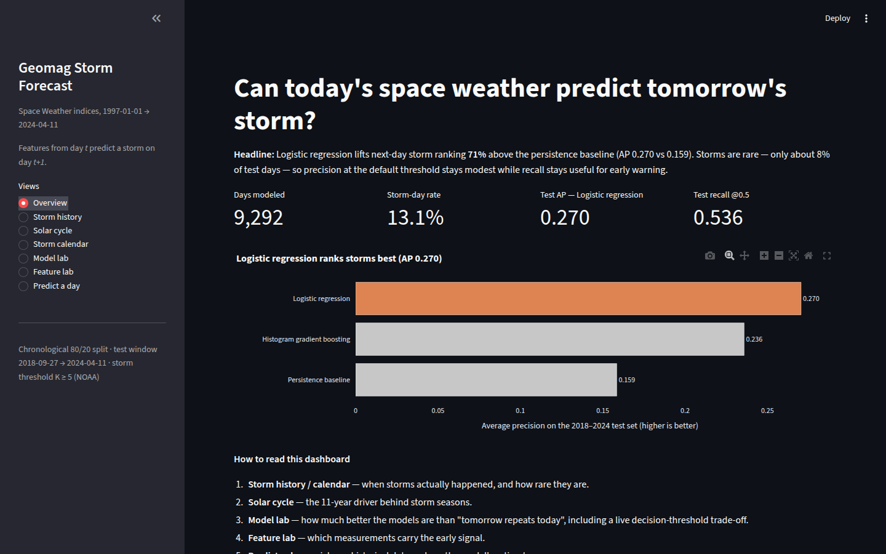
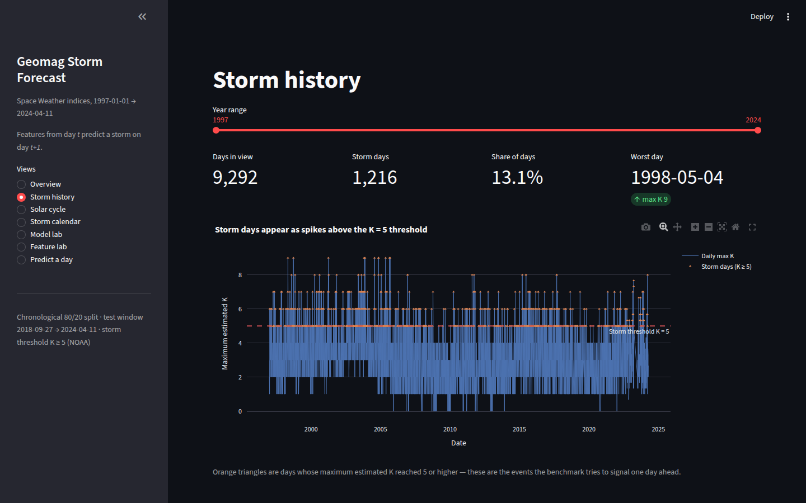

# Forecasting next-day geomagnetic storm risk from solar activity

A practical, leakage-safe benchmark that asks: **can information available by the end of day _t_ distinguish whether day _t+1_ will contain a geomagnetic storm** (maximum estimated 3-hour K-index ≥ 5)?

This repository is a faithful, runnable port of the Kaggle notebook exported in [`docs/prompt.md`](docs/prompt.md). The emphasis is a transparent early-warning baseline, not a claim of operational forecasting skill.

## Dataset

[Kaggle: Space Weather: Solar + Geomagnetic Indices](https://www.kaggle.com/datasets/erevear/space-weather-solar-geomagnetic-indices) (`erevear/space-weather-solar-geomagnetic-indices`)

| File | Contents | Shape |
| --- | --- | --- |
| `daily_geomagnetic_data.csv` | 3-hour A and K indices (middle/high latitude, estimated) | 78,672 × 7 |
| `daily_solar_data.csv` | Daily radio flux, sunspot numbers, flares, X-ray flux | 10,330 × 14 |

Coverage: 1997-01-01 → 2024-04-12. The source uses `*` (and `-1` in documentation) as missing-value sentinels; these are converted explicitly during loading.

## Methodology

1. **Discover & validate** — recursive CSV discovery (works under `/kaggle/input` on Kaggle too), schema assertions, date parsing, duplicate-timestamp and chronology checks, sentinel conversion.
2. **Aggregate** — one row per UTC day: max/mean/std of estimated K, A-index stats, observation counts, mid/high-latitude K maxima, joined with same-day solar indicators.
3. **Target** — `next_day_storm = 1` when the following day's maximum estimated K is ≥ 5 (NOAA: K = 5 or higher indicates storm conditions). The final day is dropped because its future label is unavailable.
4. **Leakage audit** — `next_day_max_k` / `next_day_storm` are excluded from the feature list; an audit table prints feature dates vs. target dates.
5. **Chronological split** — earliest 80% of dates for training, latest 20% as an untouched test set (no shuffling: nearby days belong to the same space-weather regime).
6. **Models** — a persistence baseline (today's K ≥ 5), logistic regression, and histogram gradient boosting, all with median imputation inside the pipeline and `class_weight="balanced"` for the rare-event setting.
7. **Evaluation** — average precision (primary), ROC AUC, balanced accuracy, precision/recall/F1, confusion matrix, precision-recall curves, and held-out permutation importance.

## Quickstart

Requires [uv](https://docs.astral.sh/uv/).

```bash
# 1. Fetch the dataset (needs Kaggle API credentials; see script for details)
./scripts/download_data.sh

# 2. Install dependencies and run the full pipeline
uv sync
uv run forecast
```

Figures and `results.csv` are written to `outputs/`. Useful flags:

```bash
uv run forecast --skip-plots           # metrics only
uv run forecast --data-dir /kaggle/input   # run against a Kaggle attachment
```

## Interactive dashboard

A Streamlit + Plotly explorer for the data, the models, and single-day predictions:

```bash
uv run streamlit run dashboard.py
```



**Views**

| View | What it shows |
| --- | --- |
| Overview | Dynamic headline, KPIs, model comparison (AP vs baseline) |
| Storm history | 1997–2024 daily max-K timeline with storm markers and a year-range filter |
| Solar cycle | Sunspots + radio flux on stacked axes, flare composition, storm correlations |
| Storm calendar | Year × month heatmap of storm days |
| Model lab | PR/ROC curves, results table, and a live decision-threshold slider (confusion matrix updates as you drag) |
| Feature lab | Permutation importance, feature distributions by class, 2-feature scatter |
| Predict a day | Date picker → probability gauge, persistence comparison, actual outcome |



## Project structure

```
.
├── dashboard.py                   # streamlit + plotly dashboard entrypoint
├── docs/prompt.md                 # original Kaggle notebook export (source writeup)
├── docs/dashboard_*.png           # dashboard screenshots
├── scripts/download_data.sh       # Kaggle CLI download via uvx
├── src/geomag_forecast/
│   ├── config.py                  # thresholds, expected schemas, paths
│   ├── data.py                    # discovery, validation, sentinel cleaning
│   ├── features.py                # daily aggregation, next-day target, leakage audit
│   ├── models.py                  # split, pipelines, metric computation
│   ├── evaluation.py              # figures, classification report, permutation importance
│   ├── charts.py                  # plotly figure builders for the dashboard
│   └── cli.py                     # `forecast` entrypoint
├── data/raw/                      # CSVs (gitignored)
└── outputs/                       # generated figures + metrics (gitignored)
```

## Reference results

Reported by the original notebook run (data through 2024-04-11; test window 2018-09-27 → 2024-04-11, storm rate 8.23%):

| Model | Avg. precision | ROC AUC | Balanced acc. | Precision | Recall | F1 |
| --- | --- | --- | --- | --- | --- | --- |
| Logistic regression | **0.270** | 0.734 | 0.679 | 0.212 | 0.536 | 0.304 |
| Histogram gradient boosting | 0.229 | 0.708 | 0.648 | 0.207 | 0.451 | 0.284 |
| Persistence baseline | 0.159 | 0.630 | 0.630 | 0.320 | 0.320 | 0.320 |

Top permutation importances (logistic regression): `gmag_k_mean` (0.089), `gmag_k_std` (0.028), `Radio Flux 10.7cm` (0.015), `mid_k_max` (0.012).

Storm prevalence in the model table: 13.09% (8,076 calm / 1,216 storm days).

> Logistic regression, the persistence baseline, the classification report, and the permutation importances reproduce exactly. Histogram gradient boosting can differ slightly across scikit-learn versions (e.g. AP 0.236 with scikit-learn 1.9.1); `outputs/results.csv` reflects the versions locked in `uv.lock`.

## Limitations

- Retrospective benchmark, not an operational warning system: the dataset ends in 2024 Q2, contains aggregated indices rather than raw solar-wind vectors, and includes no real-time latency simulation.
- Permutation importance is not a causal effect and is unstable under correlated predictors.
- Suggested extensions: solar-wind variables, probabilistic calibration, and rolling-origin evaluation.

## Sources

1. [NOAA Space Weather Prediction Center — Planetary K-index](https://www.spaceweather.gov/products/planetary-k-index)
2. [Kervalishvili et al. (2025), A Novel Model for Forecasting Geomagnetic Indices Using Machine Learning](https://agupubs.onlinelibrary.wiley.com/doi/full/10.1029/2025GL114848)
3. [Wang et al. (2023), A machine learning-based model for the next 3-day geomagnetic index (Kp) forecast](https://www.frontiersin.org/journals/astronomy-and-space-sciences/articles/10.3389/fspas.2023.1082737/full)
